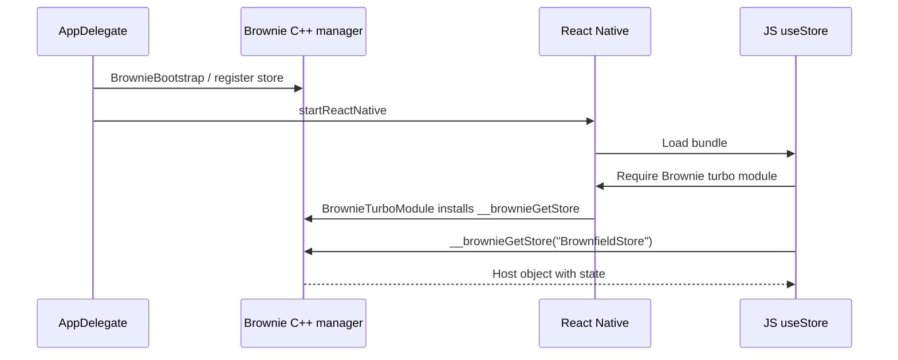

# BrownfieldStore “not found” fix (RNApp iOS)

This document summarizes the investigation and fixes for the Brownie error when running **RNApp** on iOS:

```text
[Brownie] Store "BrownfieldStore" not found.
Make sure to register it on the native side before accessing it from JS.
```

**AppleApp** (brownfield host) worked with the same JS and store schema; only standalone **RNApp** failed until these changes were applied.

---

## The problem

When running **RNApp** on iOS, React crashed on the first render of `Counter` with the error above. `useStore('BrownfieldStore', …)` in JavaScript could not see a store that native code was supposed to have registered.

---

## How Brownie works (short)

Brownie shares state between native and React Native through two layers:

1. **C++ `BrownieStoreManager`** — holds stores and backs `global.__brownieGetStore` (what JS uses).
2. **Swift `Store` / `StoreManager`** — optional native-side wrapper; `BrownfieldStore.register(...)` creates a `Store` and calls into the C++ bridge.

JavaScript (`@callstack/brownie`) reads stores via:

```ts
global.__brownieGetStore?.(key)
```

That global is installed by **`BrownieInstaller::install()`**, which must run when the Brownie turbo module is loaded under the **New Architecture**.

Native registration must hit the **same** C++ manager instance that JavaScript uses.

---

## Root causes

There were **two separate issues**, not one.

### 1. Duplicate Brownie in RNApp (main RNApp bug)

**RNApp** linked and **embedded `BrownfieldLib.framework`** into the app. That framework was built with `inherit! :complete` in the Podfile, so it contained a **full second copy** of Brownie (including its own `BrownieStoreManager` singleton).

At runtime:

| Action | Which Brownie copy |
|--------|-------------------|
| `AppDelegate` → `BrownfieldStore.register(...)` | Often the copy inside **BrownfieldLib** |
| JS → `__brownieGetStore` → C++ lookup | Copy linked into **RNApp** / React Native pods |

Registration and JS were talking to **different singletons**, so JS always saw “store not found” even though registration appeared to succeed on native.

**AppleApp** avoids this: it links **one** `Brownie.xcframework` and **one** `BrownfieldLib.xcframework` separately, and registers via `import Brownie` in the app — not by embedding a BrownfieldLib that re-exports and duplicates Brownie.

### 2. JSI bindings not installed on iOS New Architecture (brownie package bug)

On iOS with **`RCT_NEW_ARCH_ENABLED`**, React installs turbo-module JSI bindings only when the module is a **C++** `TurboModuleWithJSIBindings`.

`BrownieModule` only implemented the **ObjC** protocol `RCTTurboModuleWithJSIBindings`. In bridgeless / New Architecture, that path is **not** used; `dynamic_cast<TurboModuleWithJSIBindings*>` on the C++ module fails, so **`BrownieInstaller::install()` never ran** and `global.__brownieGetStore` stayed undefined.

Android already handled this in `BrownieModule.initialize()` via `installJSIBindingsIfNeeded()`.

This could affect any iOS React Native 0.85+ app using Brownie; RNApp made it obvious because JS hits the store immediately on launch.

---

## What we changed

### RNApp — iOS app target

| File | Change | Problem addressed |
|------|--------|-----------------|
| `ios/RNApp.xcodeproj/project.pbxproj` | Removed **link**, **embed**, and **target dependency** on `BrownfieldLib` from the **RNApp** app target. The `BrownfieldLib` target remains for `brownfield package:ios`. | Duplicate Brownie singleton |
| `ios/RNApp/AppDelegate.swift` | `import Brownie`; register store **before** `factory.startReactNative(...)` via `BrownieBootstrap.register(...)`. | Store not registered / wrong instance |
| `ios/BrownfieldLib/BrownfieldLib.swift` | Removed `@_exported import Brownie`. Only re-exports `ReactBrownfield`. | Prevent duplicate Brownie inside packaged `BrownfieldLib` |

### RNApp — Android

| File | Change | Problem addressed |
|------|--------|-----------------|
| `android/app/src/main/java/com/rnapp/MainApplication.kt` | `registerStoreIfNeeded(...)` for `BrownfieldStore` **before** `loadReactNative(this)`. | No native registration on Android |
| `android/app/build.gradle` | `implementation(project(":BrownfieldLib"))` for generated Kotlin types. | Types / brownfield lib on Android |

### `@callstack/brownie` package

| File | Change | Problem addressed |
|------|--------|-----------------|
| `packages/brownie/ios/BrownieModule.mm` | Introduced C++ `BrownieTurboModule` extending `NativeBrownieModuleSpecJSI` + `TurboModuleWithJSIBindings`; `getTurboModule` returns it; `installJSIBindingsWithRuntime` calls `BrownieInstaller::install(runtime)`. | `__brownieGetStore` never set on New Architecture |
| `packages/brownie/ios/BrownieModule.h` | Dropped unused `RCTTurboModuleWithJSIBindings` import from header. | Cleanup |
| `packages/brownie/ios/BrownieStore.swift` | Added **`BrownieBootstrap`** — registers via `BrownieStoreBridge` directly (C++ path JS uses). | Clear app entry-point API |

### RNApp — tooling

| File | Change | Problem addressed |
|------|--------|-----------------|
| `package.json` | `ios` / `android` scripts run `yarn codegen` first. | Generated Swift/Kotlin types are gitignored and must exist before build |

### Codegen (operational)

From `apps/RNApp`:

```bash
yarn codegen
```

This generates:

- `packages/brownie/ios/Generated/BrownfieldStore.swift` (gitignored)
- `android/BrownfieldLib/.../Generated/BrownfieldStore.kt`

---

## Why each fix works

### Stop embedding `BrownfieldLib` in RNApp

RNApp as a **standalone React Native app** does not need the brownfield packaging framework at runtime. Embedding it pulled in a second Brownie. After removal, there is **one** `BrownieStoreManager` in the process; registration and JS use the same store map.

`BrownfieldLib` is still built for **`yarn brownfield:package:ios`**; it is just not part of the dev app binary anymore.

### Register before React Native starts

Brownie expects stores to exist **before** the JS bundle runs components that call `useStore`. Both `AppDelegate` (iOS) and `MainApplication` (Android) register initial state before starting RN.

### `BrownieTurboModule` (library fix)

When JS first loads the Brownie turbo module, React calls `TurboModuleWithJSIBindings::installJSIBindings` on the **C++** module. That runs `BrownieInstaller::install`, which defines `global.__brownieGetStore`. Without this, JS fails even with a correctly registered native store.

### `BrownieBootstrap` (optional)

`BrownfieldStore.register` creates a Swift `Store` and also talks to the bridge. After the duplicate was removed, **`BrownfieldStore.register` is sufficient** for RNApp again.

`BrownieBootstrap` registers straight through `BrownieStoreBridge` and documents “use this from AppDelegate before RN starts.” You can use either:

```swift
// Option A — standard API (also updates Swift StoreManager for @UseStore)
BrownfieldStore.register(initialState)

// Option B — explicit C++ registration
BrownieBootstrap.register(initialState)
```

### No Brownie re-export in `BrownfieldLib`

Packaged `BrownfieldLib.xcframework` should not embed another full Brownie. Host apps (like AppleApp) link **Brownie** explicitly. That keeps brownfield packaging aligned with AppleApp’s working layout.

---

## Required vs optional going forward

### Required for RNApp

- Do **not** re-embed `BrownfieldLib` in the RNApp app target.
- Register stores before RN starts (iOS + Android).
- Keep **`BrownieTurboModule`** in `@callstack/brownie` for iOS New Architecture.
- Run **`yarn codegen`** when store schemas change.

### Optional

- `BrownieBootstrap` vs `BrownfieldStore.register` in `AppDelegate` (equivalent after duplicate fix).
- `yarn codegen &&` prepended to `ios` / `android` scripts.

### Unchanged

- **AppleApp**: `BrownfieldStore.register` in app `init`, separate `Brownie` + `BrownfieldLib` xcframeworks — no change needed.
- **BrownfieldLib** Xcode target: still used for packaging, not for day-to-day RNApp runs.

---

## End-to-end flow after fixes (RNApp iOS)



---

## Takeaway

The error looked like “forgot to register the store,” but RNApp actually had **two separate issues**:

1. **Wrong Brownie instance** (duplicate via embedded `BrownfieldLib`) — why AppleApp worked and RNApp did not.
2. **JS bridge never installed** on iOS New Architecture — fixed in the brownie library with `BrownieTurboModule`.

Removing the duplicate was the decisive fix for RNApp; the turbo module fix is still necessary for correct Brownie behavior on modern React Native iOS.
