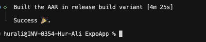
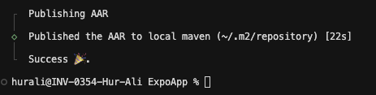
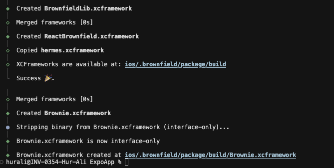

import { PackageManagerTabs } from '@theme';

# Expo Integration

This guide walks you through packaging your Expo React Native app as an **AAR** or **XCFramework** and integrating it into your native **Android** or **iOS** application.

## Prerequisites
- Install the `@callstack/react-native-brownfield` package from the quick start [section](/docs/getting-started/quick-start#installation)

## Configuration

1. Add the following block to your `app.json` file:

```json
{
  "plugins": [
    [
      "@callstack/react-native-brownfield",
      {
        "ios": {
          "frameworkName": "BrownfieldLib"
        },
        "android": {
          "moduleName": "brownfieldlib"
        },
        "debug": true
      }
    ]
  ]
}
```

2. Add the following scripts to your package.json, which will help us with generating the AAR and XCFramework. These are the scripts from [brownfield-cli](/docs/cli/brownfield):

```json
{
  "scripts": {
    "brownfield:package:android": "brownfield package:android --module-name brownfieldlib --variant release",
    "brownfield:publish:android": "brownfield publish:android --module-name brownfieldlib",
    "brownfield:package:ios": "brownfield package:ios --scheme BrownfieldLib --configuration Release"
  }
}
```

That is pretty much it from the configuration step. Now let's start with generating the AAR and later consuming it.

### AAR Generation & Publication

1. Let's first run the package command to build the AAR:

<PackageManagerTabs command="brownfield:package:android" />

This should take a few minutes and once this is done, you will see the below output:



2. Run the command to publish AAR to local maven

<PackageManagerTabs command="brownfield:publish:android" />

This should take a few minutes and once this is done, you will see the below output:



> That is all from the AAR steps. We can now consume the AAR inside a native Android App.

### AAR: Present RN UI 

1. Call the `ReactNativeHostManager.initialize` in your Activity or Application:

```kt
ReactNativeHostManager.initialize(application) {
  Toast.makeText(
      this,
      "React Native has been loaded",
      Toast.LENGTH_LONG
  ).show()
}
```

2. Add the following block to your Activity:

```kt
override fun onConfigurationChanged(newConfig: Configuration) {
    super.onConfigurationChanged(newConfig)

    ReactNativeHostManager.onConfigurationChanged(application, newConfig)
}
```

3. Use either of the following APIs to present the UI:
- ReactNativeFragment
  - See the example [here](https://github.com/callstack/react-native-brownfield/blob/41c81059acda8b134b6fea6bbbcf918c20d16552/apps/AndroidApp/app/src/main/java/com/callstack/brownfield/android/example/MainActivity.kt#L133)
- ReactNativeFragment.createReactNativeFragment
  - Follow the docs [here](/docs/getting-started/android#using-fragment)
- ReactNativeBrownfield.createView

> You can see the demo integration in [Android App](https://github.com/callstack/react-native-brownfield/blob/main/apps/AndroidApp/app/src/main/java/com/callstack/brownfield/android/example/MainActivity.kt) as well

4. Build and install the android application 🚀

<hr/>

### XCFramework Generation

1. Let's first run the package command to build the XCFramework:

<PackageManagerTabs command="brownfield:package:ios" />

This should take a few minutes and once this is done, you will see the below output:



### XCFramework: Present RN UI

##### Pre-Requisites

- Follow the step for adding the frameworks to your iOS App - [here](/docs/getting-started/ios#6-add-the-framework-to-your-ios-app)
<hr/>

1. Call the `ReactNativeHostManager.shared.initialize()` from your Application Entry point:

```swift
@main
struct IosApp: App {
    @UIApplicationDelegateAdaptor(AppDelegate.self) var appDelegate
    
    init() {
        ReactNativeHostManager.shared.initialize()
    }
    
    var body: some Scene {
        WindowGroup {
            ContentView()
        }
    }
}
```

2. Propagate the didFinishLaunchingWithOptions

```swift
class AppDelegate: NSObject, UIApplicationDelegate {
    var window: UIWindow?
    
    func application(
        _ application: UIApplication,
        didFinishLaunchingWithOptions launchOptions: [UIApplication.LaunchOptionsKey: Any]? = nil
    ) -> Bool {
        return ReactNativeHostManager.shared.application(application, didFinishLaunchingWithOptions: launchOptions)
    }
}
```

3. Use the `ReactNativeHostManager.loadView` to present the UI

```
let RNView = ReactNativeHostManager.shared.loadView(moduleName: "ExpoRNApp", initialProps: nil, launchOptions: nil)
```

> This returns a UIView, so if you're using SwiftUI, you will have to wrap this in UIViewRrepresentable .
You can see the demo integration in [Apple App](https://github.com/callstack/react-native-brownfield/blob/main/apps/AppleApp/Brownfield%20Apple%20App/BrownfieldAppleApp.swift) as well

4. Build and install the iOS application 🚀
