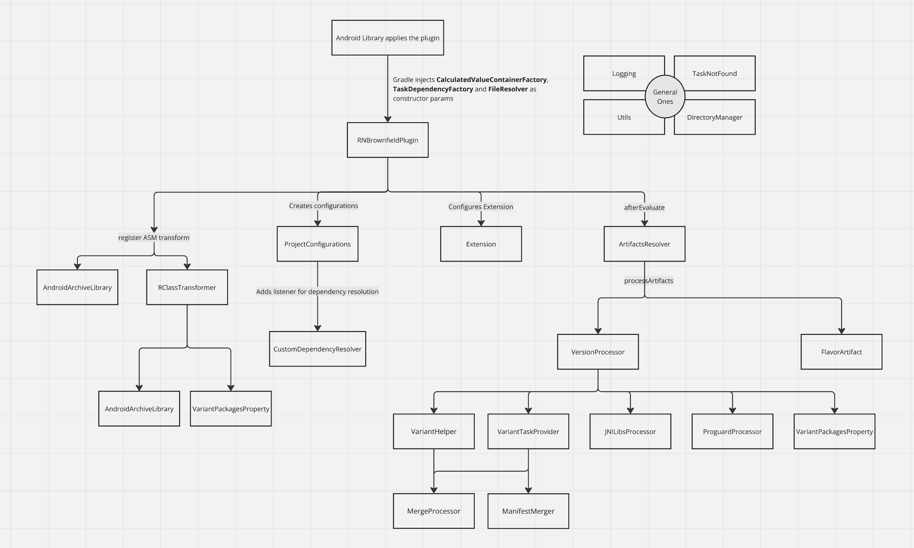

# React Native Brownfield Gradle Plugin


This plugin helps you convert your react-native brownfield implementation into a fat Aar.

## Installation

### From Remote

To your top level `build.gradle` add

```diff
buildscript {
    repositories {
        google()
        mavenCentral()
    }
    dependencies {
        classpath("com.android.tools.build:gradle")
        classpath("com.facebook.react:react-native-gradle-plugin")
        classpath("org.jetbrains.kotlin:kotlin-gradle-plugin")
+       classpath("com.callstack.react:brownfield-gradle-plugin:1.0.0")
    }
}
```

To your brownfield project level `build.gradle.kts` add

```diff
 plugins {
     id("com.android.library")
     id("org.jetbrains.kotlin.android")
+    id("com.callstack.react.brownfield")
     `maven-publish`
     id("com.facebook.react")
 }
react {
     autolinkLibrariesWithApp()
 }

 val appProject = project(":app")
```

### From Local

- From the root of this repository, run `yarn brownfield:plugin:publish:local` and it will publish the plugin to your local maven

To your top level `build.gradle` add

```diff
buildscript {
    repositories {
+       mavenLocal()
        google()
        mavenCentral()
    }
    dependencies {
        classpath("com.android.tools.build:gradle")
        classpath("com.facebook.react:react-native-gradle-plugin")
        classpath("org.jetbrains.kotlin:kotlin-gradle-plugin")
+       classpath("com.callstack.react:brownfield-gradle-plugin:1.0.0-SNAPSHOT")
    }
}
```

To your brownfield project level `build.gradle.kts` add

```diff
 plugins {
     id("com.android.library")
     id("org.jetbrains.kotlin.android")
+    id("com.callstack.react.brownfield")
     `maven-publish`
     id("com.facebook.react")
 }
react {
     autolinkLibrariesWithApp()
 }

 val appProject = project(":app")
```

## API Usage

- **About Dependencies**

You can `embed` dependencies in your Aar by using this configuration. It is as simple as doing the following:

```kts
dependencies {
    embed("com.facebook.react:hermes-android:0.77.0")
    embed("com.google.android.material:material:0.7.0")
}
```

The `embed` configuration is useful, only if you want to bundle these dependencies within your fat Aar. Be careful that it can result in clashes between the bundled version of a dependency and the version used by the App. What this means is consider you embedded dependencyA with version 0.0.1 and the native App which will use your Aar also uses dependencyA but with version 0.0.2, it will produce a clash.

If you are sure that the native App will never use the dependency you have embedded within your Aar, you should be fine with using `embed`. But if you know before hand that those dependencies can be used by the native App then it's better for you to avoid embedding and instead use either of `implementation` and `compileOnly` configuration and surface it with the native team that the Aar relies on the App to provide these dependencies.

When you use `implementation` or `compileOnly`, this plugin does not bundle those dependencies in your Aar and instead just uses them to provide for the compile time. Using these configuration is as simple as:

```kts
dependencies {
    implementation("com.facebook.react:hermes-android:0.77.0")
    compileOnly("com.google.android.material:material:0.7.0")
}
```

There is one more configuration called `api` and it is often the one you should use. The reason is that this configuration tells gradle to provide for these dependencies in compile time while developing and also provide these when the generated Aar is consumed by the native App. For the latter, you will need to use it in combination with `pom.xml` as the latter will only work if you have dependencies marked with `api` listed in `pom.xml`.

```kts
    api("com.facebook.react:react-android:0.77.0")
    api("com.facebook.react:hermes-android:0.77.0")
    implementation("com.google.android.material:material:0.7.0")
```

In react-native brownfield, when we want to use `react-android` and `hermes-android` in the Aar, we can use `api` to allow us developing and also tell gradle to provide these dependencies and it's transitive ones as well, using `pom.xml`. If the native App uses one of the transitive dependency say `javax.inject`, gradle will automatically pick the highest version. This is often the ideal usage scenario where we don't want the native App team to worry about react-native's dependencies and transitive dependencies.

<hr/>

We can use `exclude` to not embed a nested dependency:

```kts
dependencies {
    embed("com.facebook.fbjni:fbjni:0.4.0") {
        exclude("com.facebook.soloader")
    }
}
```

<hr/>
<br/>

**Expo Support**

The plugin supports Expo projects out of the box. Publishing the AAR to Maven Local will also publish the Expo dependencies to Maven Local so that they can be resolved when building the brownfield app.

<hr/>
<br/>

**Dynamic libs**

By default only `libappmodules.so` and `libreact_codegen*.so` are bundled with the aar. If you would like to bundle other dynamic libs, you can define those in the `reactBrownfield` extension as shown below:

```kts
reactBrownfield {
    dynamicLibs = listOf("libreact-native-mmkv.so", "libreact-native-fs-turbo.so")
}
```

<hr/>

## Tooling

- We are using `ktlint` and `detekt` for formatting and linting
- You can run `./gradlew :brownfield:lint` to auto-format and detect linting issues, or use the root workspace script `yarn run gradle-plugin:lint`

## Architecture

Below is a flow diagram of how the files are being used in this gradle plugin from an overview:


